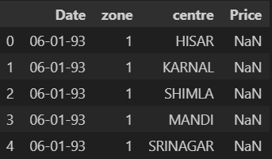
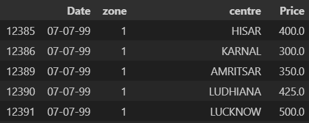
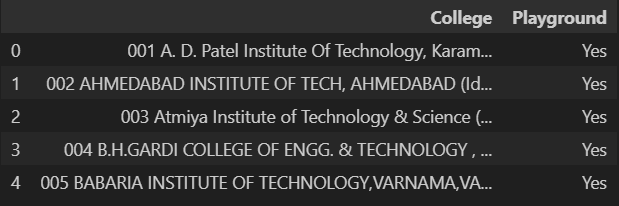
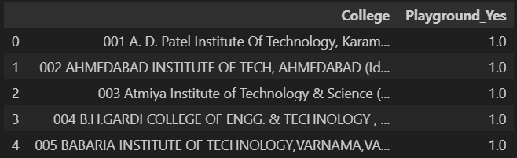
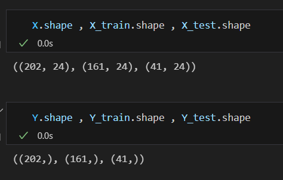

#  Data PreProcessing before ML 

<h2>1. Null Value Removal</h2>
<table>
  <tr>
    <th align="center">Before</th>
    <td></td>
  </tr>
  <tr>
    <th align="center">After</th>
    <td></td>
  </tr>
</table>

<h2>2. Encoding Categorial Data</h2>
<table>
  <tr>
    <th align="center">Before</th>
    <td></td>
  </tr>
  <tr>
    <th align="center">After</th>
    <td></td>
  </tr>
</table>

<h2>3. Splitting the data</h2>
<table>
  <tr>
    <th align="center">Before</th>
    <td></td>
  </tr>
</table>